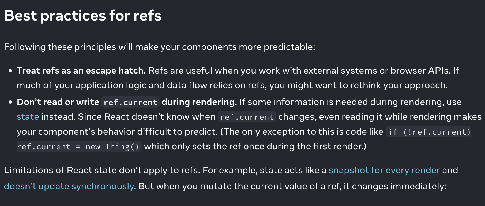
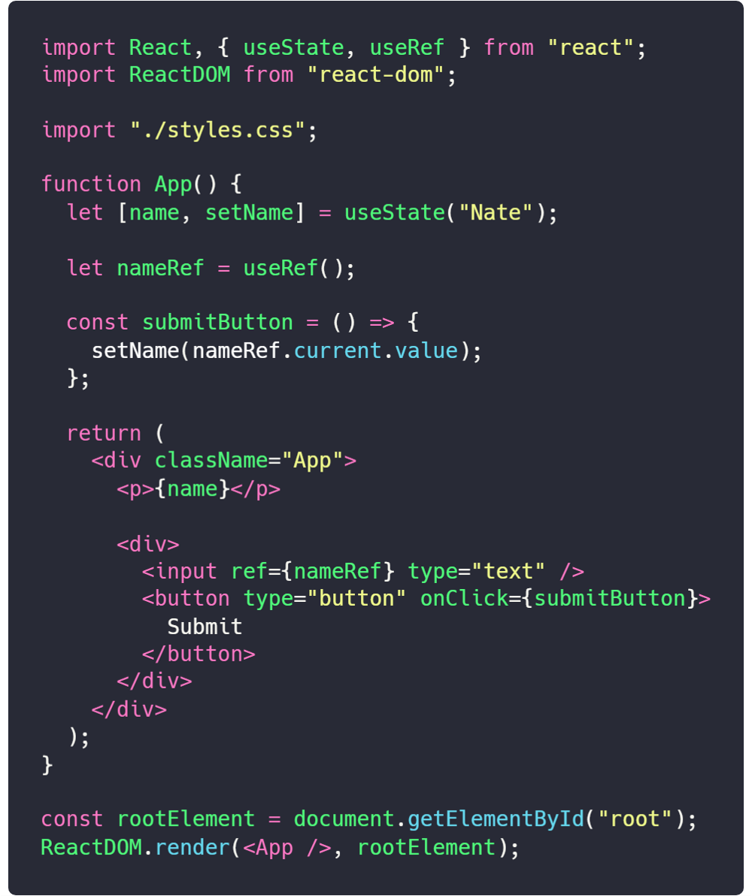

# Lesson1 - useState, useEffect

# Lesson2 - useRef, useContext, useMemo

# Hooks

`Hooks` - это функции, которые позволяют вам использовать состояние и другие возможности React без написания классов.

Для начала хотелось бы показать вам как происходит отслеживание сотсояния объектов с использованием классовых компонентов на примере обычного счетчика.

```jsx
import React, { Component } from "react";

class Counter extends Component {
  constructor(props) {
    super(props);
    this.state = {
      count: 0,
    };
  }

  increment() {
    this.setState({
      count: this.state.count + 1,
    });
  }

  render() {
    return (
      <div>
        <h1>{this.state.count}</h1>
        <button onClick={() => this.increment()}>Increment</button>
      </div>
    );
  }
}

export default Counter;
```

## useState

`useState` - это Hook, который позволяет вам добавлять состояние React в функциональные компоненты.

Пример можете посмотреть в компоненте `Counter`:

## useEffect

`useEffect` - это Hook, который позволяет вам выполнять побочные эффекты в функциональных компонентах.

То есть `useEffect` - это аналогично `componentDidMount`, `componentDidUpdate` и `componentWillUnmount` в классовых компонентах.

с помощью него мы можем задавать элементы при рендеринге компонента, а также выполнять какие-то действия при изменении состояния.

Тут нам надо подробнее разобрать его разницу в классовых компонентах и функциональных.

Давайте напишем его на классовом компоненте:

```jsx
import React, { Component } from "react";

class Counter extends Component {
  constructor(props) {
    super(props);
    this.state = {
      count: 0,
    };
  }

  componentDidMount() {
    document.title = `You clicked ${this.state.count} times`;
  }

  componentDidUpdate() {
    document.title = `You clicked ${this.state.count} times`;
  }

  increment() {
    this.setState({
      count: this.state.count + 1,
    });
  }

  render() {
    return (
      <div>
        <h1>{this.state.count}</h1>
        <button onClick={() => this.increment()}>Increment</button>
      </div>
    );
  }
}
```

В то же время в функциональных компонентах:

```jsx
import React, { useState, useEffect } from "react";

function Counter() {
  const [count, setCount] = useState(0);

  useEffect(() => {
    document.title = `You clicked ${count} times`;
  });

  return (
    <div>
      <h1>{count}</h1>
      <button onClick={() => setCount(count + 1)}>Increment</button>
    </div>
  );
}
```

## useRef

`useRef` - это Hook, который позволяет вам создавать ссылки на DOM-узлы или на любые другие элементы. Он нужен для того, чтобы ссылаться на любын нужные компоненты.



Еще раз объясню про его принцип работы, он нужен для того чтобы ссылать на любые `input` компоненты, чтобы можно было получить доступ к их значениям. По факту это как `useState()`, только наоборот.



## useContext

`useContext` - это Hook, который позволяет вам использовать значение контекста React.

## useMemo

`useMemo` - это хук, который позволяет вам хранить данные в кэше, чтобы избежать их повторного вычисления.

Тут есть два варианта использования:

1. Вы скачиваете данные с сервера и хотите их кэшировать.
2. У вас проходят сложные вычисления и вы хотите их кэшировать.

Все примеры будут в файлах `useMemo.js` и `useMemo2.js`.

Второй параметр в `useMemo` - это массив зависимостей, если в этом массиве есть изменения, то `useMemo` будет пересчитывать данные.

Если второго параметра нет, то `useMemo` будет пересчитывать данные при каждом рендере.

# High Order Components

`High Order Components` - это функции, которые принимают компонент и возвращают новый компонент.

Они используются для повторного использования логики, которая применяется к нескольким компонентам.

```jsx

import React from "react";

const withCounter = (WrappedComponent) => {
  class WithCounter

  return WithCounter;

};

export default withCounter;

```

## useCallback

Говорю сразу, это тоже самое что и `useMemo`. Вот разница:

`useMemo` - кеширует результат выполнения функции, а `useCallback` - кеширует саму функцию.

Во многих случаях они взаимозаменяемы, но есть случаи, когда нужно использовать `useCallback`. Например если функция используется в качестве пропса для компонента, то лучше использовать `useCallback`.

По сути вот такая запись, это одно и то же:

```jsx
const a = useMemo(() => someFunc(), [someVar]);
const b = useCallback(someFunc(), [someVar]);
```

Показыаю пример в файле `CallbackExample.js`.


То есть если сравнить эти два хука, то `useMemo` лучше использовать для запросов на сервер, сложных вычислений, а `useCallback` если компонент принимает функцию в качестве пропса или если функция используется в `useEffect`.

Тут есть спорный момент, если у вас в `useEffect` идет запрос на api, то лучше использовать `useMemo`, так как `useCallback` будет вызывать функцию при каждом рендере.


## useReducer 

`useReducer` - очень простой хук, тоже самое что и `useState`, только вместо одного значения, он принимает функцию. Когда использовать ? Если к вас к одному объекту идет много действий, то лучше использовать `useReducer`.

Показываю пример в файле `ReducerExample.js`.


