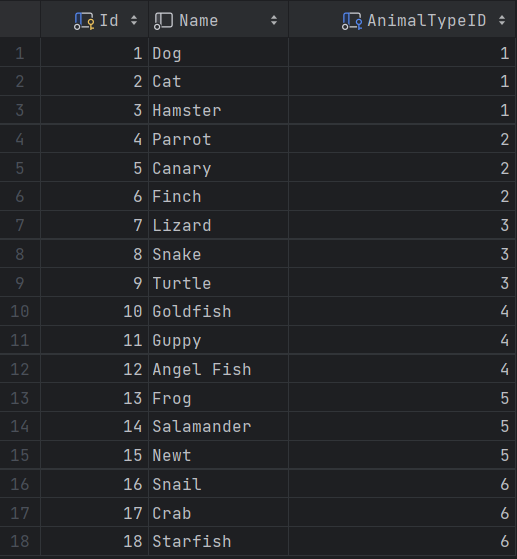

# Введение в предмет SQL 

## Что такое SQL ?

Structured Query Language (SQL) - язык структурированных запросов. Это язык программирования, который используется для работы с базами данных. SQL позволяет выполнять множество операций с данными, таких как создание, изменение, удаление, вставка и многое другое. SQL является стандартом ANSI (American National Standards Institute), что означает, что он является стандартом для всех `реляционных` баз данных.

## Что такое реляционная база данных ?

Это обычная, даже можно сказать excel таблица, в колонках и строках которой хранятся данные. 

### Почему реляционная ? 

Потому что в строках таблиц может храниться указатель на другую таблицу, в которой хранятся данные, которые относятся к строке первой таблицы.

## SQL - это язык запросов

Его используют в различных базах данных, таких как MySQL, PostgreSQL, Oracle, Sybase, Informix и Microsoft SQL Server. Язык SQL позволяет извлекать данные из базы данных, изменять данные в базе данных и управлять базой данных. SQL является стандартом ANSI.

Первоначальная версия SQL была создана в 1986 году и называлась SEQUEL, что означает Structured English Query Language. В 1989 году SEQUEL был переименован в SQL.

## MS SQL Server

Microsoft SQL Server - это система управления реляционными базами данных (RDBMS), разработанная корпорацией Microsoft. Это продукт, который включает в себя две различные версии для разных аудиторий:

- MS SQL Server Express(Developer) - бесплатная версия, которая предназначена для разработчиков и небольших приложений. Он имеет ограничения по размеру базы данных и производительности.

- MS SQL Server Enterprise - платная версия, которая предназначена для крупных приложений. Он имеет множество функций, которые не доступны в бесплатной версии.

- - RDBMS - Relational Database Management System

MS SQL Server - это один из самых популярных RDBMS, используемых в различных приложениях. ОН был написан на языке С++. Он поддерживает множество языков программирования, таких как C++, Java, PHP, Python и т.д. Он поддерживает множество операционных систем, таких как Windows, Linux, Solaris, Unix и т.д.

## SSMS - SQL Server Management Studio

По сути программа для упраления вашими БД

Мы с вами будем пользовать как SSMS, так и DataGrip 
от JetBrains

По моему мнению, DataGrip лучше, но он не может заменить SSMS в некоторых случаях.

## Что нужно для работы с SQL ?

1. SQL - это декларативный язык, поэтому вам не нужно знать языки программирования, такие как C++, Java, PHP и т.д. Но вы должны знать, как работать с базами данных.
2. SQL - это не язык программирования, но в MS SQL Server используется расширения языка, который называется T-SQL (Transact-SQL). 
T-SQL - это расширение SQL, которое добавляет некоторые функции, такие как процедуры, функции, триггеры и т.д.

Соответственно, здесь можно создавать переменные, 
писать условия, циклы, функции и т.д.

Но он все еще не является языком программирования,
так как он не предназначен для написания программ,
а для написания запросов к базе данных.

