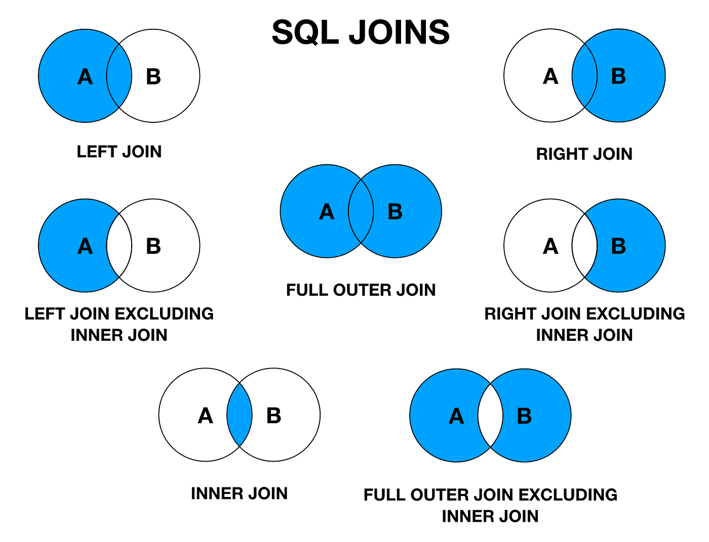

# Joins 

Как мы уже прошли с вами на прошлом уроке, 
таблицы в SQL чаще всего бывают связаны между собой.

В связи с этим, возникает необходимость объединять
данные из разных таблиц в один результат.
Для этого в SQL существуют операторы JOIN.

Всего есть 4 типа JOIN:
- INNER JOIN
- LEFT JOIN
- RIGHT JOIN
- FULL JOIN

Давайте рассмотрим каждый из них на примере. 




## self join

Self join - это когда мы объединяем таблицу саму с собой.

Например, у нас есть таблица с сотрудниками, и мы хотим
получить список всех сотрудников, которые работают в одном
отделе с сотрудником с id = 1.

```sql
select e1.name, e2.name
from employees e1
join employees e2 on e1.department_id = e2.department_id
where e2.id = 1
```

## cross join


Cross join - это когда мы объединяем каждую строку одной таблицы
с каждой строкой другой таблицы.

Например, у нас есть таблица сотрудников и таблица отделов,
и мы хотим получить список всех сотрудников и отделов.

```sql
select e.name, d.name
from employees e
cross join departments d
```

