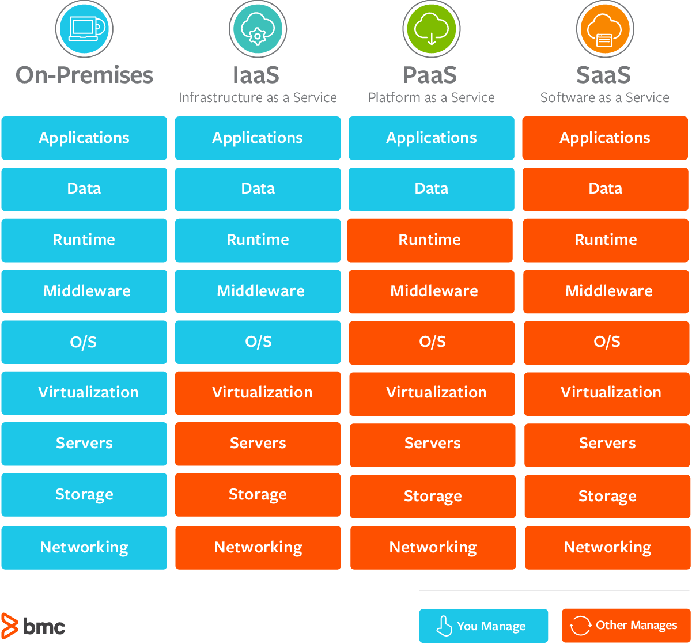

# Урок №1. Введение в Azure

## План урока:

- Разница между хостингом и облаком
- On premises, IAAS, SAAS, PAAS
- Azure Cost managment
- Availibility, Geo-redundancy 

# Хостинг

Это высокоуровневая платформа, на которую вы загружаете свое приложение и/или бд и все связанное с ним.

Тут конечно можно много спорить на счет момента с его высоким уровнем, но мы делать этого не будем.

Если взять старые времена то хостинг это был всего лишь сервер в аренду. Вы запускали на ней к примеру IIS (Internet Information Services) или какой-то прокси сервер типо Nginx, Apache. Все настраивали вручную.

В данный момент времени такие сервисы предоставляют не только инфраструктуру, а еще и платформу и программы. Например сервис GoDaddy, Wordpress, Wix и т.д.

Чтобы полностью понять смысл Azure, вам нужно понять какие проблемы он решает и чем он отличается от вышеперечисленного.

Давайте представим что Баха хочет основать компанию и у него безлимитное кол-во денег.

Баха основывает компанию один и ему нужно построить свою IT инфраструктуру. Предположим у него будет сайт и небольшой CRM

# On Premises

В этом случае Баха принимает решение купить сервер, построить IT отдел и нанять нужных людей. Давайте подумаем сколько времени и денег ему нужно будет.

На постройку серверной с б/у комплектующими у него уйдет больше 5000 AZN. Это еще минимум. Также он будет платить за свет, аренду помещения, обслуживание и т.д. Не забываем что он еще может ломаться. Один из крайне важых моментов это настройка безперебойного интернета и света. В наших реалиях это невероятно сложно. В случае использования `On premises` вы все делаете с нуля и сами. Такой подход абсолютно не нужен, если вы делаете заказ или просто начинающая компания.

# IAAS (Infrastructure as a service)

В этом случае вы берете ифраструктуру в аренду у какой-то компании. Настройкой этого сервера и всем остальным вы заниматетесь сами. В таком случае вам все еще нужно иметь людей, но вы уже не обслуживаете его физически.

# PAAS (Platform as a service)

В этом случае вы берете готовую внимание НАСТРОЕННУЮ инфраструктуру, то есть к примеру `smarterasp.net` это `PAAS` сервис который дает вам узкую возможность без вариантов ошибки. Он дает вам хостинг с готовой настройкой WebDeploy или Docker Container Registry на который вы просто загружаете свое приложение.

С таким подходом при инициализации сервера вы просто выбираете свою конфигурацию.

Например при создании аккаунта я указываю свой Runtime и SDK. Выбираю сервер и тип Deployю. Там же вы можете указать Environment Variables чтобы изменять наши переменные среды типо `Development` или `Production`. Он может также дать вам даже `SMTP` сервер.

Еще раз, в таком случае у вас обычная админ панель. Вы не можете взять и что-то свое в него встроить. Если ваш сервер не дает вам FTP, у вас не будет FTP.

# SAAS (Software as a service)

Это вообще не про то что я говорил сверху. В обычных сервисах вы такое не найдете. Такие сервисы как `Azure`, `AWS`, `Google Cloud` позволяют внедрять в ваш проект какие-то программы. Например Azure Speech to Text, Google translate, amazon identity и так далее. Они дают вам API своего продукта который вы можете вставить в свой.

## Azure Cost Managment

`Azure` - сам по себе не является ультра дорогим, но если вы неправильно его настроете он сожрет ваши деньги настолько быстро, что вы не успеете моргнуть.

Есть отдельный онлайн калькулятор которым удобно пользоваться. Также он нужен если вы делаете заказ и должны послать инвойс заказчику.

## Availbility 

Azure гарантирует вам полную доступность, то есть он говорит что интрнет и свет точно не вырубится и никаких перебоев не будет. Вы должны понимать что даже такие большие компании не могут дать вам. 

