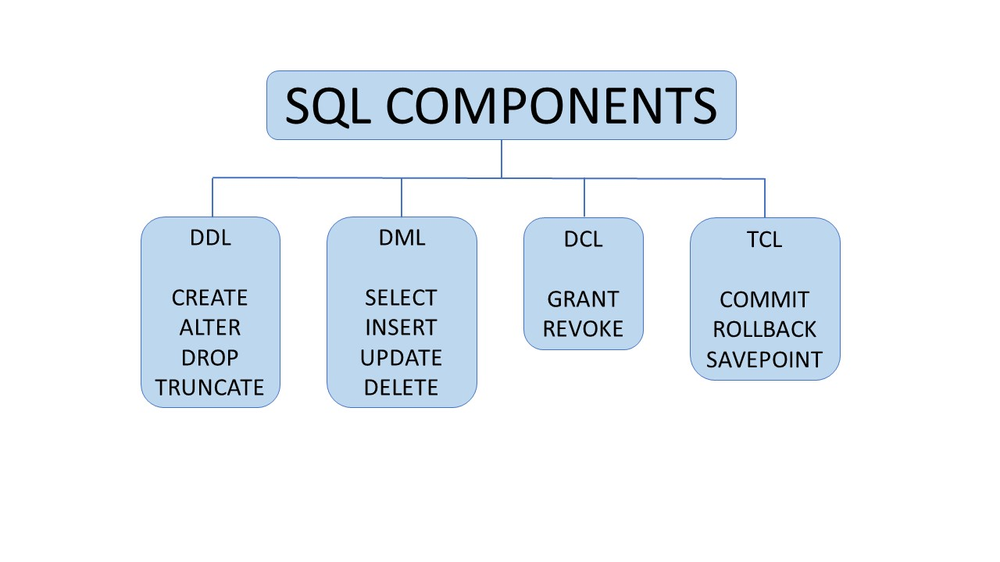

# Создание таблиц в MS SQL

Еще раз напоминаю, что вся работа проходит 
в `T-SQl`, что является расширением `SQL`.
По факту вы не можете использовать MS SQL Server
и писать на обычном `SQL`

## String types (Типы строк)
- char(n)
- varchar(n)
- nchar(n)
- nvarchar(n)
- text

char - ASCII, фиксированная длина, n - количество символов
varchar - ASCII, переменная длина, n - количество символов
nchar - Unicode, фиксированная длина, n - количество символов
nvarchar - Unicode, переменная длина, n - количество символов

При использовании `Unicode` используйте `N` перед строкой/ 
Пример: `N'Hello'`

## Date and time types (Типы даты и времени)
- date. Дата без времени
- time. Время без даты
- datetime. Дата и время
- datetime2. Дата и время с большей точностью
- datetimeoffset. Дата и время с часовым поясом

## Integer types (Типы целых чисел)
- bit. 0 или 1
- tinyint. 0 до 255
- smallint. -2^15 до 2^15-1
- int. -2^31 до 2^31-1
- bigint. -2^63 до 2^63-1
- decimal(p,s). Число с фиксированной точностью и масштабом
- numeric(p,s). Число с фиксированной точностью и масштабом
- money. Денежная сумма
- smallmoney. Денежная сумма с меньшей точностью
- float(n). Число с плавающей точкой
- real. Число с плавающей точкой с меньшей точностью
- bigint. -2^63 до 2^63-1

Разница между `decimal` и `numeric` в том, что `decimal`
использует `fixed-point` а `numeric` - `floating-point`.
То есть `decimal` - фиксированная точность, а `numeric` - нет.

# Создание таблицы и группы синтаксиса

В общем и целом есть 4 группы синтаксиса:
- DDL. Data Definition Language. 
- DML. Data Manipulation Language.
- DCL. Data Control Language.
- TCL. Transaction Control Language.



Для создания таблицы используется `DDL` синтаксис.

```sql
CREATE TABLE table_name (
    column1 datatype OPTIONS,
    column2 datatype,
    column3 datatype,
);
```

Один из самых главных опций - `PRIMARY KEY`.
Он переводится как первичный ключ и является уникальным
