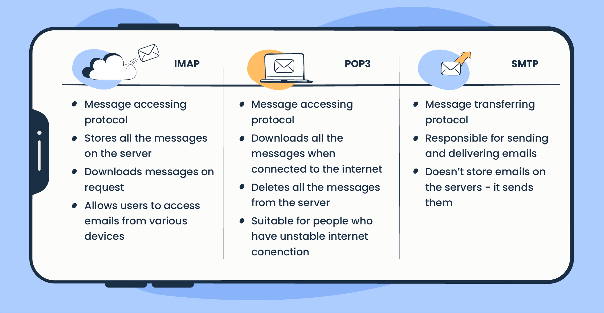

# Почтовые протоколы 

Как я уже вам говорил, по модели OSI протоколы делятся 
на разные уровни. Если TCP/UDP протоколы это протоколы транспортного 
уровня, то почтовые протоколы уже прикладного уровня. 

Какие почтовые протоколы мы с вами знаем ?
- IMAP 
- POP3 
- SMTP 

Дополнительно мы с вами пройдем MIME 

Давайте разберемся... 

## SMTP - Simple Mail Transfer Protocol 

Данный протокол нужен для отправки сообщений. 
Ни в коем случае не путайте его с SMTP Server(о нем мы 
поговорим чуть позже)

В общем и целом данный протокол самый известный, используемый
и общедоступный для отправки почтовых сообщений. 

SMTP Server - это сервер, который принимает и пересылает ваши
сообщения. 

// enas buej ovhc bsnj

