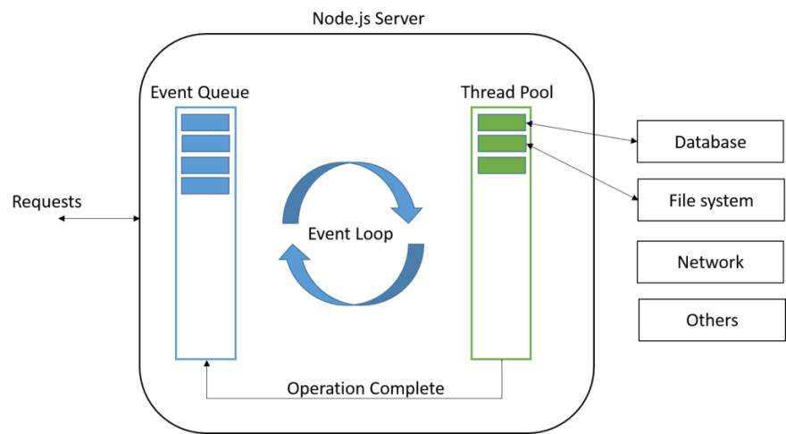
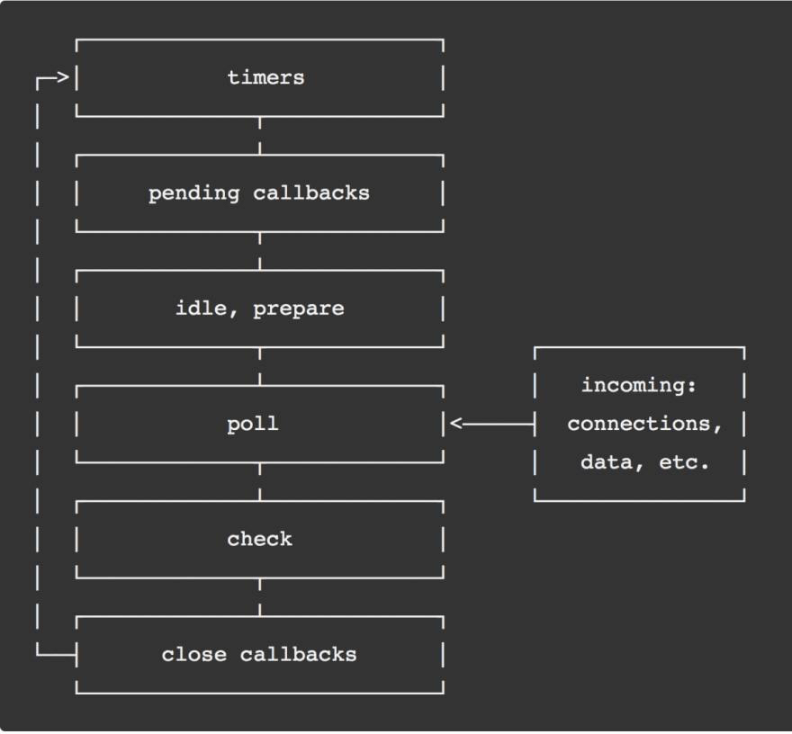

# Введение в Node.js

- Что такое Node.js
- Введение в реактивное программирование
- История Node.js
- Node.js vs Browser
- Создание проекта на Node.js
- EcmaScript
- CommonJS vs ESM
- ключевое слово global
- npm vs npx

# Что такое Node.js

`Node.js` - это среда выполнения JavaScript, построенная на движке V8, который используется в браузере Google Chrome. Node.js позволяет запускать JavaScript на сервере. Он был создан с целью расширения возможностей JavaScript за пределы браузера и позволяет разработчикам использовать JavaScript для написания инструментов командной строки и для создания скриптов на стороне сервера. Node.js также позволяет разработчикам создавать высокопроизводительные сетевые приложения, такие как веб-серверы.

`Node.js` не используется только для создания веб-серверов. По сути он является экспортером `Js` за пределы браузера, чтобы вы могли писать консольные утилиты, скрипты для автоматизации задач, серверные приложения и многое другое. На нем вы можете писать `Back-end` для веб-приложений, мобильных приложений, десктопных приложений и даже для `IoT` устройств. `IoT` - это `Internet of Things` - это сеть физических устройств, в которую встроены датчики, программное обеспечение и другие технологии, которые обмениваются данными между собой и с другими системами через сеть.

# Введение в реактивное программирование

Возможно сейчас вас ждет немного странностей, но вы должны понять что `JavaScript` не поддерживает многопоточность. `Node.js` решил эту проблему с помощью `Event Loop`.

Для того чтобы понять зачем он нужен, давайте рассмотрим работу веб-сервера и поговорим про I/O bound операции и подумаем про `10k problem`.



Для I/O операций в Node.js используется `Thread Pool`, который позволяет выполнять операции ввода-вывода в отдельных потоках. Это позволяет избежать блокировки основного потока и увеличить производительность приложения. В таком случае, когда операция ввода-вывода завершается, Node.js помещает результат в очередь событий, и когда основной поток освобождается, он обрабатывает это событие.



Очередь событий достаточно простая модель, но она позволяет Node.js обрабатывать тысячи запросов одновременно. Давайте представим себе последовательность событий:

```js
console.log("Start");

setTimeout(() => {
  fetch("https://jsonplaceholder.typicode.com/todos/1")
    .then((response) => response.json())
    .then((json) => console.log(json));

  console.log("Timeout");
}, 100);

console.log("End");
```

Тут `callback queue` будет ждать пока `call stack` освободится и только после этого выполнит `callback` функцию.

## Node.js vs Browser

`Node.js` и `браузер` используют один и тот же движок `V8`, но они предназначены для разных целей. `Браузер` предназначен для отображения веб-страниц и выполнения клиентского кода, в то время как `Node.js` предназначен для создания серверных приложений и выполнения кода на стороне сервера.

`Node.js` предоставляет разработчикам доступ к системным ресурсам, таким как файловая система, сеть и процессы. Он также предоставляет разработчикам возможность создавать высокопроизводительные сетевые приложения, такие как веб-серверы и чат-серверы.

## Создание проекта на Node.js

Для создания проекта на Node.js вам понадобится установить Node.js на свой компьютер. Вы можете скачать его с официального сайта [nodejs.org](https://nodejs.org/). После установки Node.js вы можете создать новый проект, используя команду `npm init`. Эта команда создаст файл `package.json`, который содержит информацию о вашем проекте, такую как имя, версия, зависимости и скрипты.

```bash
npm init -y
```

## EcmaScript

`EcmaScript` - это стандартный язык программирования, который используется во всех современных браузерах и средах выполнения JavaScript, включая Node.js. `EcmaScript` определяет синтаксис и функциональность языка JavaScript, такие как переменные, функции, классы, модули и т. д. `EcmaScript` обновляется каждый год, и новые возможности добавляются в язык.

## CommonJS vs ESM

`CommonJS` и `ESM` - это два различных способа импорта и экспорта модулей в Node.js. `CommonJS` - это стандартный способ импорта и экспорта модулей в Node.js, который используется в большинстве проектов. `ESM` - это новый стандартный способ импорта и экспорта модулей в Node.js, который был добавлен в Node.js версии 12. `ESM` позволяет использовать синтаксис `import` и `export`, который используется в браузере.

## Создание модулей

В Node.js модули - это отдельные файлы, которые содержат код, который можно использовать в других файлах. Модули в Node.js могут экспортировать переменные, функции, классы и объекты, которые могут быть использованы в других модулях. Для экспорта переменных, функций, классов и объектов из модуля вам нужно использовать ключевое слово `module.exports` или `exports`. Для импорта переменных, функций, классов и объектов из модуля вам нужно использовать функцию `require`.

```js
// module.exports.add = function add(a, b) {
//   return a + b;
// }

// module.exports.subtract = function subtract(a, b) {
//   return a - b;
// }

function add(a, b) {
  return a + b;
}
function subtract(a, b) {
  return a - b;
}

module.exports = {
  add,
  subtract,
};
```

```js
// const math = require('./math');

import { add, subtract } from "./math";
```

## ключевое слово global

`global` - это глобальный объект в Node.js, который предоставляет доступ к глобальным переменным и функциям. `global` - это объект, который содержит все глобальные переменные и функции, которые доступны во всех модулях Node.js. Вы можете использовать `global` для создания глобальных переменных и функций, которые могут быть использованы во всех модулях Node.js.

Его нужно ичпользовать очень осторожно, так как это может привести к проблемам с производительностью и безопасностью.

```js
global.a = 1;

global.foo = function () {
  console.log("foo");
};

console.log(a);
foo();

console.log(global);
```

## npm vs npx

`npm` и `npx` - это два инструмента для управления зависимостями и скриптами в Node.js. `npm` - это менеджер пакетов Node.js, который используется для установки, обновления и удаления зависимостей в вашем проекте. `npx` - это инструмент, который позволяет запускать скрипты из установленных пакетов без необходимости установки их глобально.
