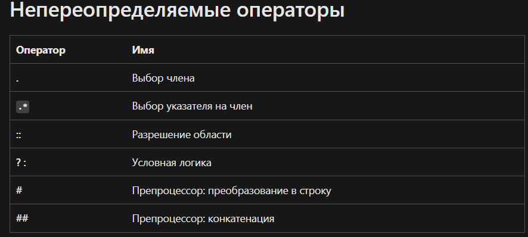

# Тема урока: Полиморфизм
Полиморфизм исходит из латинского слова "Polymorph" - много форм. 

Пример полиморфизма в жизни - это вода. Вода может быть в разных агрегатных состояниях: твердое, жидкое, газообразное. Но при этом это все равно вода. Так и в программировании, полиморфизм - это когда объекты с одинаковой спецификацией могут иметь различную реализацию.

В программировании полиморфизм - это способность объекта менять свое поведение в зависимости от внешних или внутренних изменений самого объекта.

Существует два вида полиморфизма: 
* статический
* динамический

## Статический - проходит на этапе компиляции
* Перегрузка методов
* Перегрузка операторов
* Шаблоны функций
* Шаблоны классов

## Динамический - проходит на этапе выполнения
* Абстрактные функции
* Виртуальные функции
* Виртуальные деструкторы

Примеры статического полиморфизма:
* Перегрузка функций
```cpp
float add(float a, float b) {
    return a + b;
}

string add(string a, string b) {
    return a + b;
}

int main() {

    add(1, 2);
    add("Hello", "World");

    
    return 0;
}
```
* Перегрузка методов - это тоже самое что и перегрузка функций, только методы находятся внутри класса

```c++
class Person {
    void eat(string food) {
        cout << "I am eating " << food << endl;
    }

    void eat() {
        string mealName;
        cout << "What are you eating? ";
        cin >> mealName;
        cout << "I am eating " << mealName << endl;
    }
};
```

* перегрузка операторов
```c++
#include <iostream>
#include <string>

using namespace std;

class Person {
private:
    uint16_t age;
public:
    string name;
    string surname;

    Person() = default;

    Person(string name, string surname, uint16_t age) {
        this->name = name;
        this->surname = surname;
        this->age = age;
    }

    void setAge(uint16_t age) {
        if (age > 0 && age < 150)
            this->age = age;
    }

    uint16_t getAge() const {
        return this->age;
    }

    bool operator==(const Person &other) const {
        return this->name == other.name && this->surname == other.surname && this->age == other.age;
    }

    bool operator!=(const Person &other) const {
        return !(*this == other);
    }

    bool operator<(const Person &other) const {
        return this->age < other.age;
    }

    bool operator>(const Person &other) const {
        return this->age > other.age;
    }

    bool operator<=(const Person &other) const {
        return this->age <= other.age;
    }

    bool operator>=(const Person &other) const {
        return this->age >= other.age;
    }

    friend ostream& operator << (ostream& os, const Person& person) {
        os << person.name << " " << person.surname << " " << person.getAge();
        return os;
    }

    friend istream& operator >> (istream& is, Person& person) {
        cout << "Enter name: ";
        is >> person.name;

        cout << "Enter surname: ";
        is >> person.surname;

        cout << "Enter age: ";
        is >> person.age;

        return is;
    }
};


int main() {


//    Person p1("Elvin", "Azimov", 21);
//    Person p2("Elnur", "Mamedov", 19);
//    Person p3("Elvin", "Azimov", 21);
//
//    cout << (p1 == p2) << endl;
//    cout << (p1 == p3) << endl;
//
//    cout << p1;

    Person p1;
    cin >> p1;
    cout << p1;

    return 0;
}
```

Какие операторы нельзя перегружать в С++:


* Шаблоны функций мы уже прошли
* Шаблоны классов рассмотрим при реализации динамических структур данных 

##  Введение в динамический полиморфизм
ключевое слово virtual - мы можем переопределить функцию в дочернем классе


